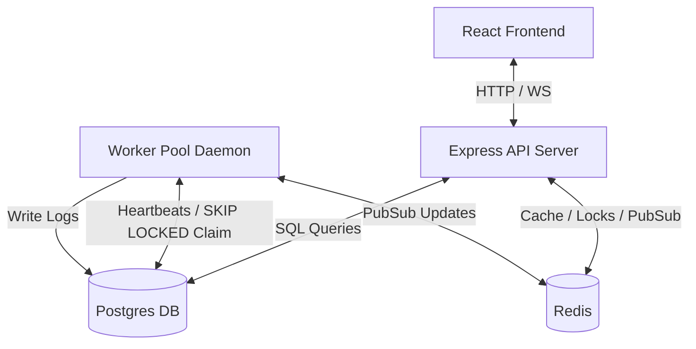
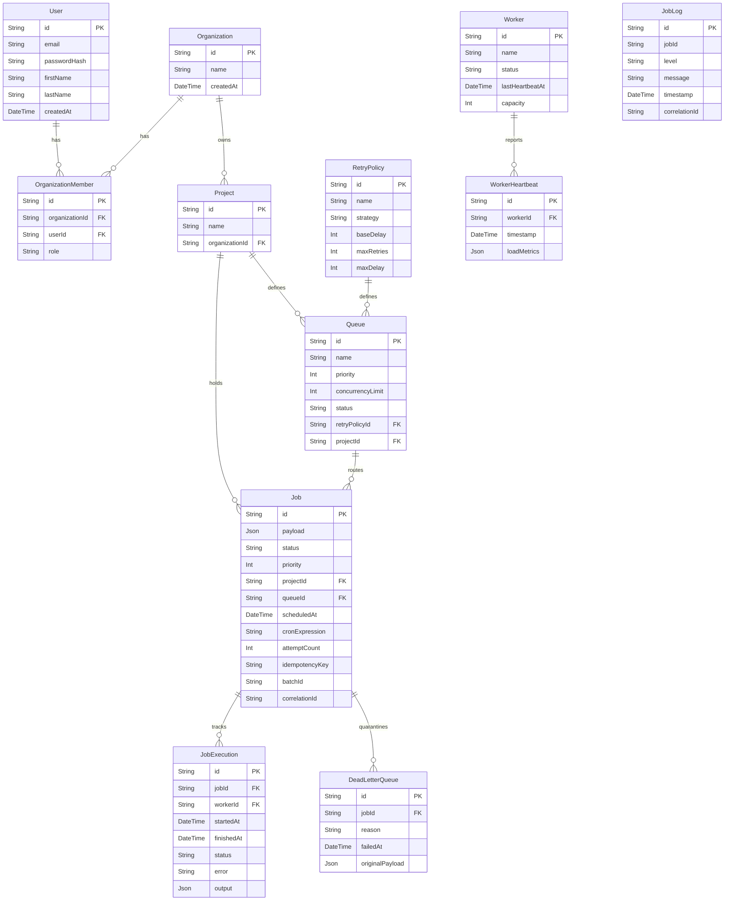

# Architecture Documentation

This document describes the system architecture, entity relationships (ER), and job execution sequence lifecycles.

## 1. System Architecture Diagram
The system follows a distributed monorepo microservice layout:
- **React Frontend**: Hydrates analytics charts and connects via WebSockets for live status updates.
- **Express API Instance(s)**: Handles user access, job submissions, rate limiting, and project configurations.
- **Postgres Database**: Acts as the transactional, persistent source of truth.
- **Redis Cache/PubSub**: Manages rate-limiting buckets, idempotency request locks, and streams real-time updates to connected Socket.IO sockets.
- **Worker Daemon pool**: Scaleable workers pulling jobs concurrently and processing payloads.



## 2. Entity-Relationship (ER) Diagram
Normalized database schema defined inside Prisma:



## 3. Job Lifecycle Sequence Diagram
The end-to-end execution lifecycle transitions:

```mermaid
sequenceDiagram
    autonumber
    actor Client as Client / Dashboard
    participant API as Express API
    participant DB as Postgres Database
    participant Redis as Redis Cache
    participant Worker as Worker Process

    Client->>API: POST /api/projects/:projectId/jobs (payload, queueId, Idempotency-Key)
    API->>Redis: Check Idempotency key lock
    alt Key exists (Conflict / HIT)
        API-->>Client: Return existing Job response
    else Key free (MISS)
        API->>Redis: Acquire lock (5s)
        API->>DB: INSERT INTO "Job" (status: QUEUED, correlationId: UUID)
        API->>Redis: Release lock
        API-->>Client: Return 201 Created (Job ID, correlationId)
    end

    loop Poll Interval (e.g. 1s)
        Worker->>DB: BEGIN Transaction; SELECT FOR UPDATE SKIP LOCKED WHERE status = QUEUED & scheduledAt <= NOW()
        alt Job available & Concurrency Limits NOT hit
            DB-->>Worker: Return Job row
            Worker->>DB: UPDATE Job status = CLAIMED; COMMIT
        else Concurrency Limit or Queue Paused
            Worker->>DB: ROLLBACK Transaction
        end
    end

    Worker->>DB: UPDATE Job status = RUNNING & INSERT JobExecution (startedAt)
    Worker->>DB: INSERT JobLog (correlationId, level: INFO, "Executing payload...")
    
    alt Task Success
        Worker->>DB: UPDATE Job status = COMPLETED & UPDATE JobExecution (status: COMPLETED)
        Worker->>Redis: Publish job-updates channel
    else Task Fails (Attempts < MaxRetries)
        Worker->>DB: Calculate retry delay & UPDATE Job status = QUEUED, scheduledAt = Future
        Worker->>DB: UPDATE JobExecution (status: FAILED, error: trace)
    else Task Fails (Attempts >= MaxRetries)
        Worker->>DB: UPDATE Job status = DLQ & INSERT DeadLetterQueue record
        Worker->>DB: UPDATE JobExecution (status: FAILED, error: trace)
        Worker->>Redis: Publish job-updates channel
    end
```
